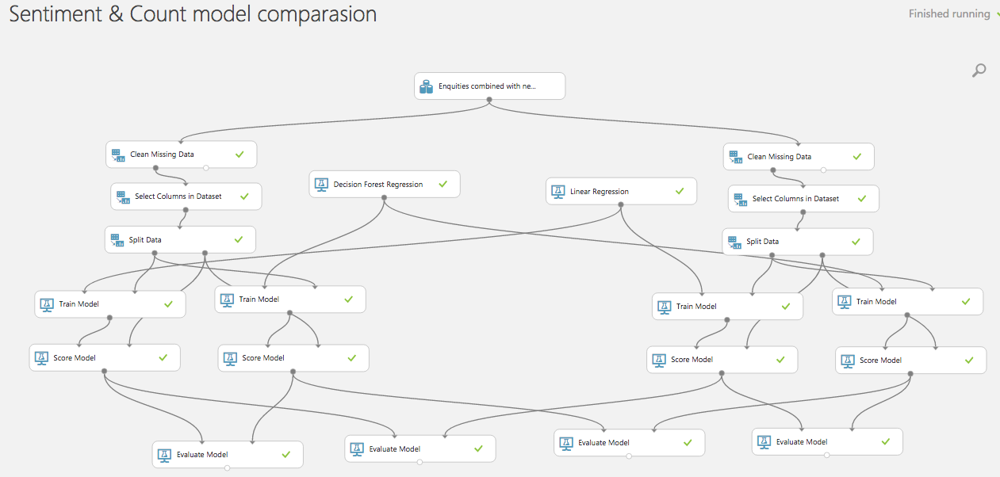

# UCL Data Science Challenge 

For the purpose of this challenge we have been exploring the correlation between news articles and prices. 

## Machine Learning Models
We have used Decision Forest Regression and Linear Regression to create a model comparison between sentiment and count based models.

## Notebooks
- **Comparing news sentiment and stock price (all - microsoft).ipynb** - 
- **Events and stock price correlation.ipynb** - 
- **Microsoft Enquity.ipynb** - 

## Data Sets Used 
- the main data set we had used was provided by Bloomberg and it contained equities, indexes, etc. 
- [https://github.com/philipperemy/financial-news-dataset](https://github.com/philipperemy/financial-news-dataset)